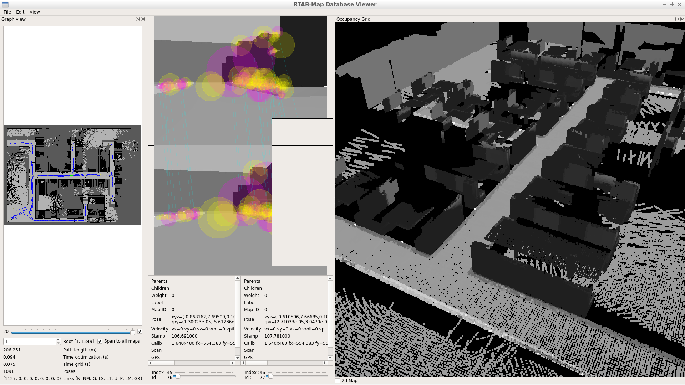

# RTAB-Map
Real-Time Appearance-Based Mapping for robot SLAM localization implemented with ROS.
Implemented together with acml location and move_base planing.

# Final result
After robot has visit all pasible allowed areas in the world, the generated robot rtab-map look like this:
the gereated map can be download for [here](https://mega.nz/file/Kr5x3YDJ#UAQzoXGsuqNT73yCbGEm0rRFXAfErLKSmpokqoKYcYY). (!!332MB)


Image shows that 5 closed loops where achieve.(G=5; in down-left side of screen).


# Install and Run

Dependenties packages must be installed in your computer, if your using Lubuntu you can install as:
```sudo apt-get install ros-kinetic-rtabmap-ros
```
for other installation system please check oficial [instructions](https://github.com/introlab/rtabmap_ros#rtabmap_ros)

For running the code you need to build the project as :
``` cd <project_root_dir>: 
    ./catkin_make
    ./source devel/setup.bash
    ./roslaunch my_robot world.launch
```
# Launch Robot States
By default the robot will be launch with a static map loaded and able to locate itself using this map.
Also, by default the robot has path planning activated.
to make the robot actually use the RTAB-map capability, you need to run the robot in mapping or location state as:  

## Mapping
Mapping state makes the robot generate a new map each time the code is run.
to launch the robot in a mapping state run the following:
```
roslaunch my_robot world.launch
roslaunch my_robot mapping.launch
```

## Locations
Location states allows the robot to use the previous generated map to locate itself and
move arrond the world. 
To launch the robot in a location state run the following:
```
roslaunch my_robot world.launch
roslaunch my_robot location.launch
```

# Packages
used packages:
1. [RTAB-Map](http://wiki.ros.org/rtabmap_ros)
⋅⋅⋅2D Laser sensor_msgs/LaserScan messages
⋅⋅⋅Odometry sensors, providing nav_msgs/Odometry messages 
⋅⋅⋅3D Camera, compatible with openni_launch, openni2_launch or freenect_launch ROS packages      

# Citations
1. Udacity Robotics Software Engineer Nanodegree Program
